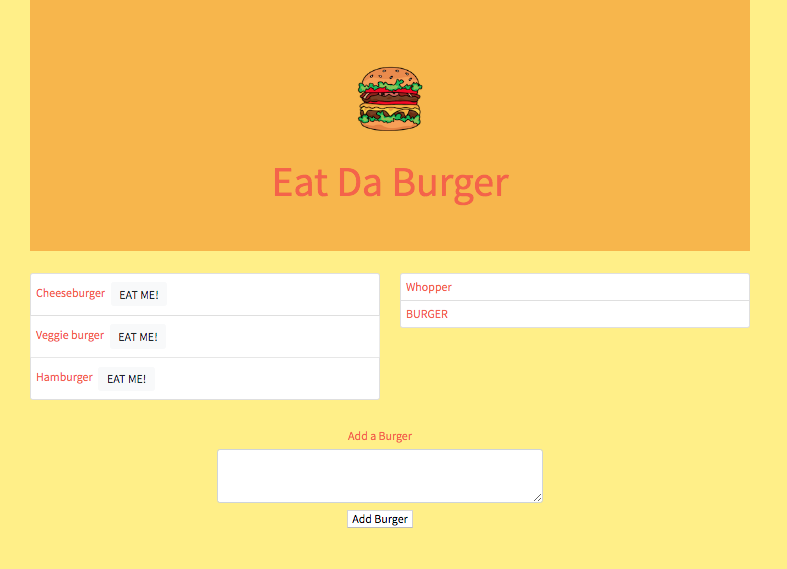

# Eat Da Burger

Eat Da Burger is a burger logger created with MySQL, Node, Express, Handlebars and a homemade ORM. Following the MVC design pattern, Eat Da Burger uses Node and MySQL to query and route data, and Handlebars to generate the HTML.

## Installation
### To run locally:
* Add your root password on line 11 of connection.js to connect to the mySQL database
* Navigate to the project's root directory and run `npm install`
* The application is invoked with the command `node server.js`

## Domains
* Eat Da Burger is currently being hosted on [Heroku](https://heroku.com/) at https://calm-ravine-62059.herokuapp.com/

## Built with:
* CSS, Javascript, Node
* [Express](https://www.npmjs.com/package/express/)
* [Handlebars](https://www.npmjs.com/package/handlebars/)
* [MySQL](https://www.npmjs.com/package/mysql/)

## Contact
#### Email
* brittanie.boyko@gmail.com
